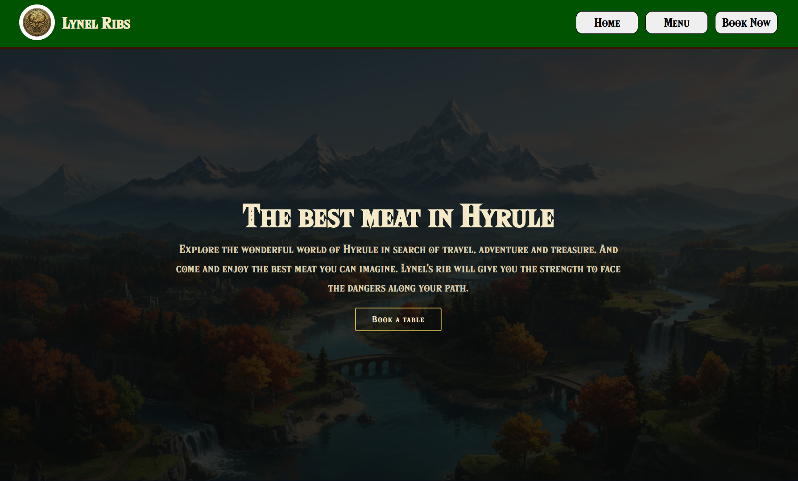

# Restaurant Page - The Odin Project
This project is part of [The Odin Project](https://www.theodinproject.com) curriculum.
It is a restaurant page themed around **The Legend of Zelda** video game franchise.
 
## Preview
You can access the website [here](https://louis-dub.github.io/restaurant-page_odin/).

 
## Features
On this website, you can:
- See various dishes from **The Legend of Zelda: Breath of the Wild**
- Navigate smoothly between the different pages of the website

## Technologies Used
- **HTML5**: For the semantic structure of the website
- **CSS3**: For custom styling
- **Node.js**: For providing a runtime environment to run Webpack
- **Webpack**: For bundling the JavaScript modules and deploying the site

## What I learned
- Building a website using multiple JavaScript files
- Deploying a site that does not have an index.html file
- Automating deployment with GitHub Actions
